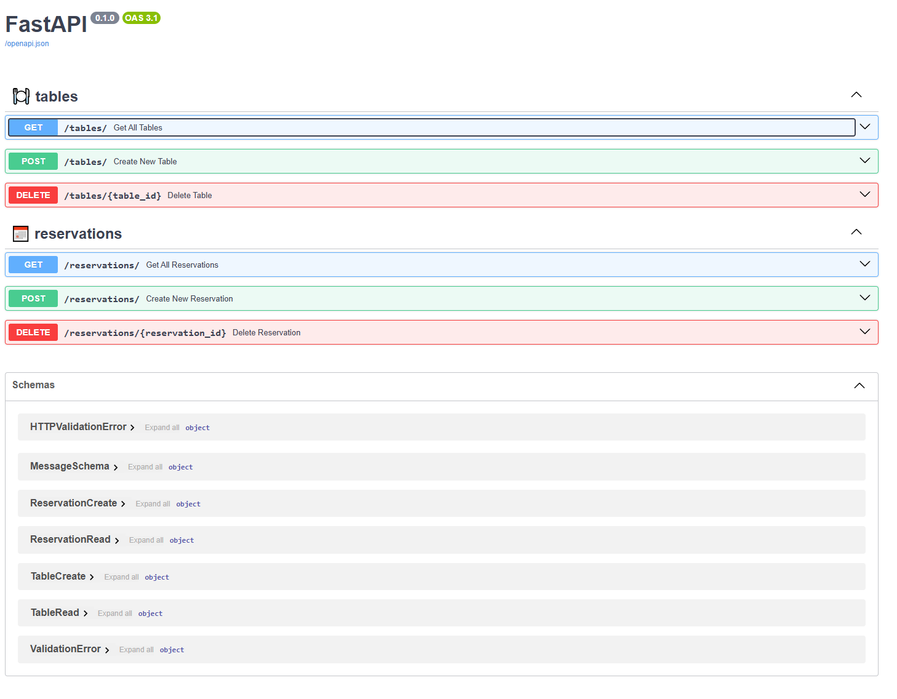
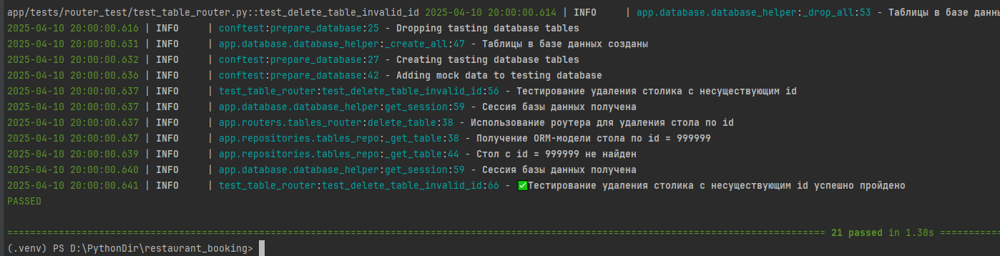

<p align="center">
  
</p>

<h1 align="center">Restaurant Booking API</h1>


## Содержание

- [Описание проекта](#описание-проекта)
- [Стек](#стек)
- [Структура проекта](#структура-проекта)
- [Переменные окружения](#переменные-окружения)
- [Запуск проекта на сервере Linux](#запуск-проекта-на-сервере-linux)
  - [Шаг 1: Установка Docker и Docker Compose](#шаг-1-установка-docker-и-docker-compose)
  - [Шаг 2: Подготовка docker-compose.yml](#шаг-2-подготовка-docker-composeyml)
  - [Шаг 3: Запуск контейнеров](#шаг-3-запуск-контейнеров)
- [Интерфейс Swagger API](#интерфейс-swagger-api)
- [Тестирование](#тестирование)
- [Скриншоты](#скриншоты)

## Описание проекта

**Restaurant Booking API** — это backend-сервис, разработанный с использованием FastAPI. Сервис предоставляет функциональность бронирования столиков в ресторане с возможностью отследить конфликты при бронировании

Основные функции:

- Получение данных о столах/резервов
- Добавление/удаление столов и резервов
- Бронирование столов пользователями
- Проверка конфликтов при бронировании


## Стек

- **FastAPI** – веб-фреймворк
- **SQLAlchemy** – ORM
- **PostgreSQL** – база данных
- **Alembic** – миграции
- **Docker + Docker Compose** – контейнеризация
- **Pytest** – тестирование

## Структура проекта

```bash
├── alembic/              # Миграции
├── app/
│   ├── core/             # Настройки и утилиты
│   ├── database/         # Расположение DBHelper, подклчюение к БД
│   ├── logs/             # Папка для хранения лог файлов
│   ├── migrations/       # Папка Alembic
│   ├── services/     # Папка для репозиториев
│   ├── routers/          # Папка для сервисов
│   └── schemas/          # Папка для Pydantic схем
│   ├── tests/            # Содержит unit и интеграционные тесты
│   └── main.py           # Точка входа
├── doc/                  # Папка для логотипа документации
├── logs/                 # Папка для хронения логов при тестировании
├── Dockerfile            # Докер файл для приложения
├── poetry.lock
├── pyproject.toml        # Файлы poetry
├── pytest.ini            # Файл с настройками pytest
└── README.md             # Файл документации
└── requirements.txt      # Дополнительный файл зависимостей, если используете pip

```

## Переменные окружения

В `.env` файле необходимо указать:

```env

MODE - Режим работы приложения (DEV, PROD, TEST)

DB_ECHO - Настройка вывода SQL запросов

DB_HOST - Хост базы данных

DB_PORT - Порт базы данных

DB_NAME - Название базы данных 

DB_LOGIN - Логин для подключения к базе данных 

DB_PASSWORD - Пароль для подключения к базе данных

Для тестовой базы данных:

DB_HOST_TEST - Хост для тестовой базы данных 

DB_PORT_TEST - Порт для тестовой базы данных 

DB_NAME_TEST - Название тестовой базы данных 

DB_LOGIN_TEST - Логин для подключения к тестовой базе данных 

DB_PASSWORD_TEST - Пароль для подключения к тестовой базе данных 

```

## Запуск проекта на сервере Linux

### Шаг 1. Установка Docker и Docker Compose

Следуйте [официальной инструкции Docker](https://docs.docker.com/engine/install/ubuntu/) и [Docker Compose](https://docs.docker.com/compose/install/).

### Шаг 2. Подготовка docker-compose.yml

```yaml
version: '3.8'

services:
  db:
    image: postgres:16
    restart: always
    environment:
      POSTGRES_DB: restaurant_booking_db
      POSTGRES_USER: postgres
      POSTGRES_PASSWORD: rbdb111
    ports:
      - "5432:5432"
    volumes:
      - postgres_data:/var/lib/postgresql/data
    healthcheck:
      test: ["CMD-SHELL", "pg_isready -U postgres"]
      interval: 5s
      timeout: 5s
      retries: 5

  app:
    image: dontworrybro/restaurant-booking-api:latest
    restart: unless-stopped
    depends_on:
      db:
        condition: service_healthy
    ports:
      - "8000:8000"
    environment:
      MODE: DEV
      DB_HOST: db
      DB_PORT: 5432
      DB_NAME: restaurant_booking_db
      DB_USER: postgres
      DB_PASSWORD: <---- тут пароль для подключения к БД postgres
      
      DB_HOST_TEST: localhost
      DB_PORT_TEST: 5432
      DB_NAME_TEST: restaurant_booking_test
      DB_LOGIN_TEST: postgres
      DB_PASSWORD_TEST: <---- тут пароль для подключения к БД postgres
    command: >
      sh -c "alembic upgrade head && uvicorn app.main:app --host 0.0.0.0 --port 8000"

volumes:
  postgres_data:

```

### Шаг 3. Запуск контейнеров

```bash
sudo docker-compose up --build
```

Для остановки:

```bash
sudo docker-compose down
```

## Интерфейс Swagger API

Swagger-документация будет доступна после запуска по адресу:

```
http://<IP адрес сервера>:8000/docs
```

## Тестирование

```bash
pytest
```
Для тестирования приложения необходимо наличие БД по подключению (restaurant_booking_test)
Тесты находятся в директории `tests/` и покрывают основные функции API, включая бронирование и т.д.

## Скриншоты

<h1 align="center">Swagger-документация</h1>
<p align="center">
  
</p>


<h1 align="center">Тесты</h1>
<p align="center">
  
</p>


